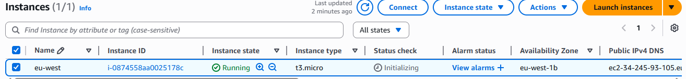
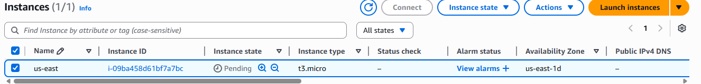
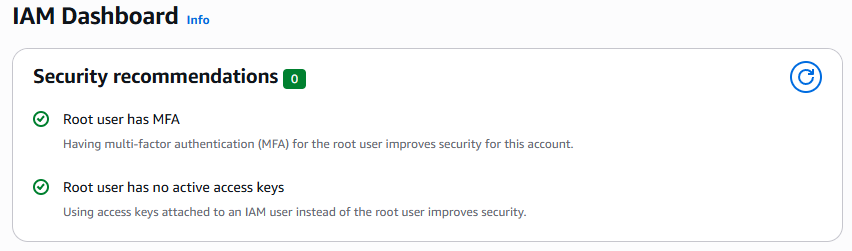
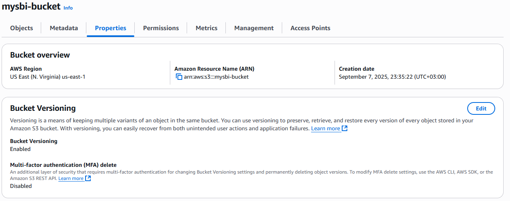
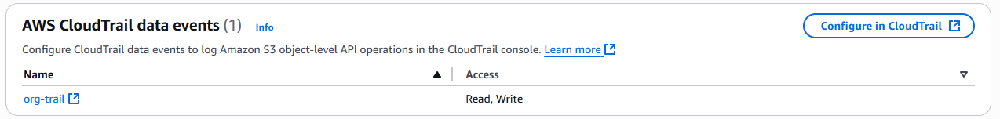
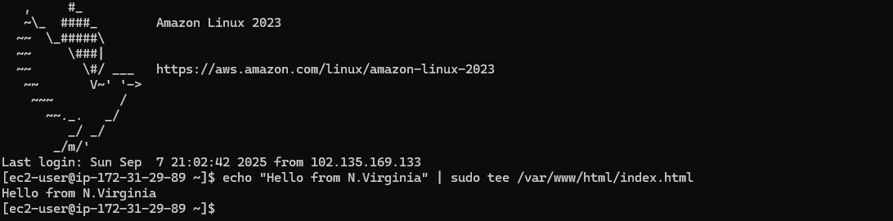

# Project 2: Multi-Region Cloud Security Setup
## Goal
Deploy and secure cloud infrastructure across two regions, enforce identity & access controls,
and document the architecture as if you were working in a global IT team.
You’ll show you can:
• Work with cloud resources across regions
• Configure IAM (Identity and Access Management)
• Apply security best practices (logging, MFA, firewall rules)
• Write a security policy document

## Setup
• Cloud Provider: AWS Free Tier (recommended)

• Regions:

    US-East-1 (Virginia)
    EU-West-1 (Ireland)

• Resources:

    2 EC2 instances (1 per region)
    1 S3 bucket
    IAM users/roles

## Walkthru
### Step 1: Create Two EC2 Instances (Different Regions)
1. Log in to AWS Management Console.
2. Launch an EC2 instance in US-East-1:

        Amazon Linux 2 or Ubuntu
        t2.micro (free tier)
        Allow SSH (port 22) + HTTP (port 80) in Security Group

3. Repeat the same in EU-West-1.
Now you have servers in two global regions.

### Step 2: Configure IAM & MFA
1. Create a new IAM user:

        Assign least privilege (e.g., read-only S3 + EC2 Start/Stop).

2. Enable Multi-Factor Authentication (MFA) for root and IAM user.
3. Attach a role to your EC2 instance that allows only specific actions (e.g., write logs to
S3).

### Step 3: Secure S3 Bucket
1. Create an S3 bucket (name must be globally unique).
2. Block all public access.
3. Enable versioning + server-side encryption (SSE-S3).
4. Enable bucket logging to CloudTrail.

### Step 4: Enable CloudTrail Logging
1. Go to CloudTrail → Create a new trail.
2. Log all management events.
3. Store logs in your secured S3 bucket.

### Step 5: Deploy Simple Web App
1. SSH into both EC2 instances.
2. Install Apache or Nginx:
3. sudo apt update && sudo apt install apache2 -y
4. echo "Hello from <region>" | sudo tee /var/www/html/index.html

