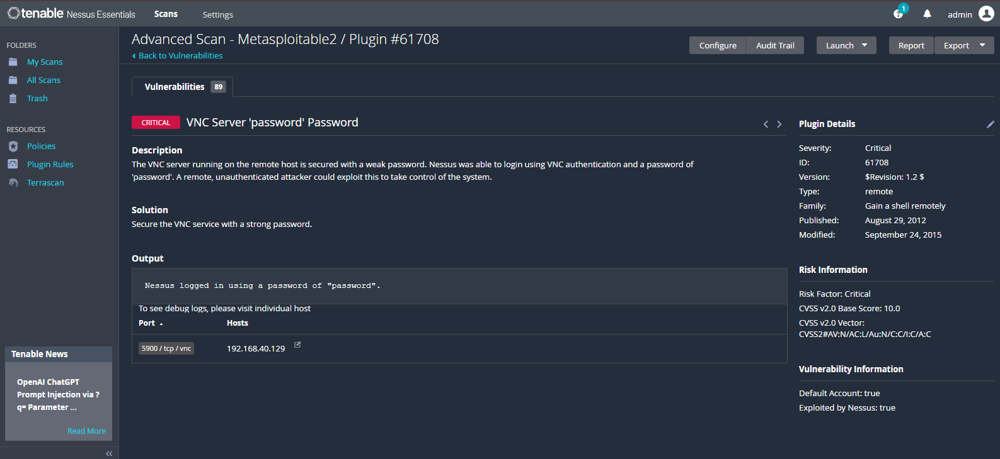
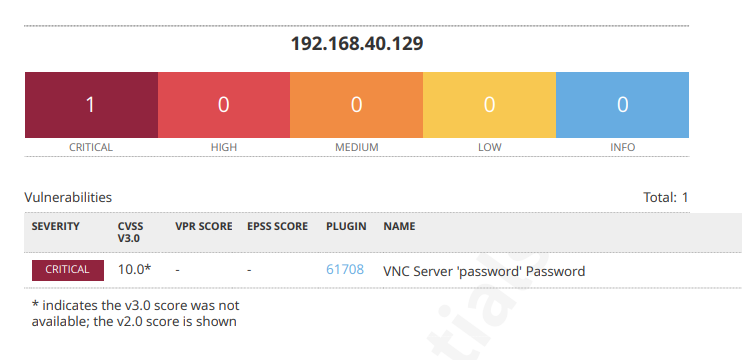
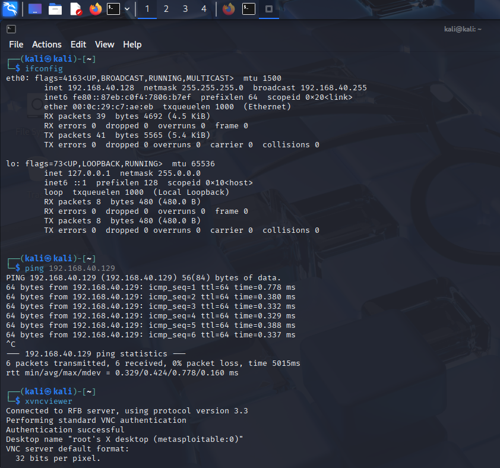

# Project 4: Vulnerability Assessment & Reporting
## Goal
Perform a vulnerability scan against a test machine, analyze results, validate at least one finding,
and produce a professional risk assessment report.
You’ll show you can:
1. Set up a vulnerability scanner (Nessus Essentials or OpenVAS)
2. Run scans and interpret results
3. Validate vulnerabilities
4. Write a structured risk-based remediation report

## Setup
• Vulnerability Scanner VM →

    Nessus Essentials (Free, up to 16 hosts)
• Target VM →

    Ubuntu Server OR Windows 10 VM

## Walkthru
### Step 1: Install Nessus Essentials
    On your scanner VM (Ubuntu):

        curl --request GET \
        --url
        'https://www.tenable.com/downloads/api/v1/public/pages/nessus/downloads/18545
        /download?i_agree_to_tenable_license_agreement=true' \
        --output Nessus.deb

        sudo dpkg -i Nessus.deb
        sudo systemctl start nessusd
        Then access Nessus at:
        https://<scanner-ip>:8834
        • Register for Nessus Essentials (free license key).
        • Activate scanner.

### Step 2: Run Vulnerability Scan
1. Add a New Scan → Basic Network Scan.
2. Enter your target VM’s IP.
3. Start scan and wait for results.

### Step 3: Analyze & Validate Findings
Look at Critical/High vulnerabilities first.
Example findings:

        OpenSSH outdated → CVE listed
        Weak SSL/TLS cipher suites
        Outdated Apache version

### Step 4: Exploit the vulnerability to gain access

 Validate at least one finding manually:

    If Nessus says “Weak SSH password,” try brute-forcing with Hydra (from Project 3).
    If it says “Apache outdated,” run apache2 -v on target to confirm.

